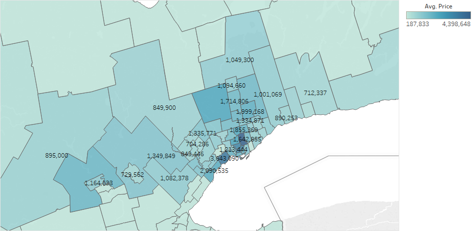

# Housing Prices GTA

Get housing prices from realtor for houses in the greater toronto area.

## Scripts

### scrape_realtor.py

This sends post requst and get's all houses based on a region and saves information into a pandas dataframe. Then it gets saved to a CSV.

### join_data.py

This combines many CSVs made using scrape_realtor into one big CSV.

### find_region.py

This find's the electoral district of a house based on its latitude and longtitude obtained from scrape_realtor and adds a new column with this information.

### convert_coords.py

This is used to convert the Stats Canada shape files to WGS84, which is the format of realtor coordinates. It also gets just the regions in Ontario.

### info_from_col.py

Uses regex to parse out more useful information from columns.

## Visualizations

Some graphs made on tableau using the data:
<https://public.tableau.com/views/HousingPricesinGreaterTorontoArea/Sheet2?:embed=y&:display_count=yes&:origin=viz_share_link>

## Firebase Firestore Webpage

<https://myapp-18b49.firebaseapp.com/>

